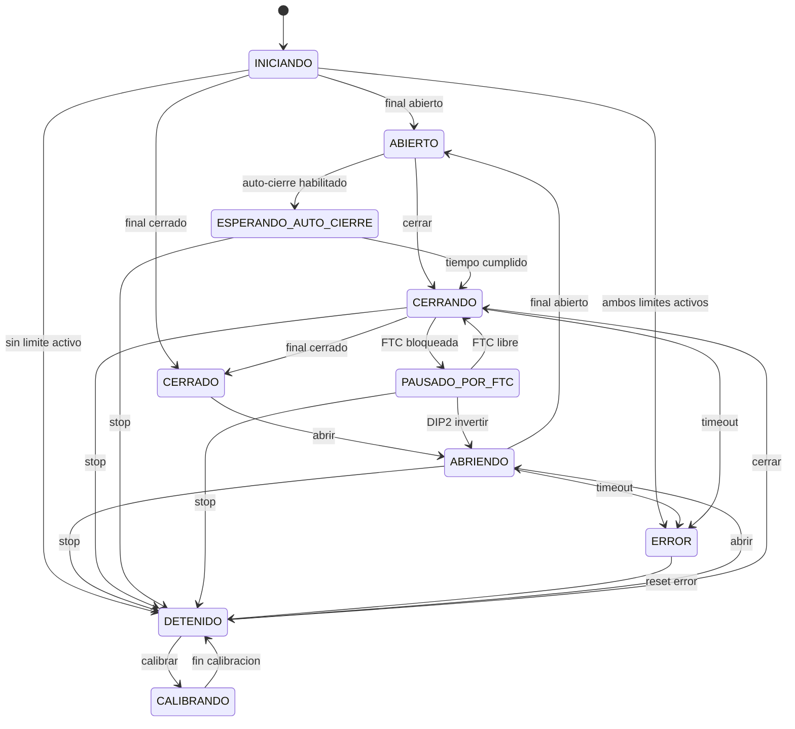

# Porton Seguro IoT

Proyecto educativo de control de porton automatico con ESP32 clasico, ESP-IDF, MQTT local y app movil. El firmware esta preparado para placas tipo ESP32 DevKit / ESP32-WROOM-32 y target `esp32`.

## Estructura

```text
Tarea 6/
  firmware/      Proyecto ESP-IDF en C
  mobile_app_maui/ App movil .NET MAUI
  mobile_app/    Alternativa Expo React Native
  scripts/       Utilidades para Mosquitto, MQTT y serial
  tests/         Pruebas basicas de la maquina de estados
  docs/          Documentacion complementaria
```

## Firmware

El firmware usa modulos separados:

- `input_manager`: lectura con debounce de botones, finales, FTC y DIP switch.
- `gate_fsm`: maquina de estados del porton.
- `motor_control`: manejo seguro de reles, nunca activa abrir y cerrar al mismo tiempo.
- `mqtt_manager`: comandos, estado, telemetria, eventos, ACK y configuracion por MQTT.
- `wifi_manager`: conexion WiFi usando `secrets.h`.
- `storage`: persistencia en NVS.
- `buzzer` y `status_led`: indicacion local.
- `encoder` y `display`: reservados y deshabilitados inicialmente.

Antes de compilar, copia el ejemplo de secretos:

```powershell
Copy-Item .\firmware\main\secrets.h.example .\firmware\main\secrets.h
```

Edita `firmware/main/secrets.h` con tu red WiFi y la IP del broker Mosquitto. Ese archivo esta ignorado por Git.

Compilar:

```powershell
cd "C:\Users\Roand\Documents\Javier_Pacheco_MICRO_2026_C2\Tarea 6\firmware"
idf.py set-target esp32
idf.py build
```

Flashear por COM11:

```powershell
idf.py -p COM11 flash monitor
```

Tambien puedes usar:

```powershell
..\scripts\flash_com11.ps1
..\scripts\serial_monitor_com11.ps1
```

## Pinout

| Funcion | GPIO | Tipo | Nota |
|---|---:|---|---|
| Final abierto NC | 34 | Entrada | Externo pull-up/pull-down requerido; bajo = activo/falla segura |
| Final cerrado NC | 35 | Entrada | Externo pull-up/pull-down requerido; bajo = activo/falla segura |
| Fotocelda FTC | 36 | Entrada | Externo pull-up/pull-down requerido; bajo = bloqueada |
| Boton abrir | 18 | Entrada | Activo en bajo, pull-up interno |
| Boton cerrar | 19 | Entrada | Activo en bajo, pull-up interno |
| Boton stop | 23 | Entrada | Activo en bajo, pull-up interno |
| DIP1 encoder futuro | 2 | Entrada | Activo en bajo |
| DIP2 reaccion FTC | 4 | Entrada | Activo en bajo: invertir durante cierre |
| DIP3 auto-cierre fisico | 16 | Entrada | Activo en bajo |
| DIP4 mantenimiento | 17 | Entrada | Activo en bajo |
| Rele abrir | 25 | Salida | Activo alto |
| Rele cerrar | 26 | Salida | Activo alto |
| Buzzer | 27 | Salida | Activo alto, solo 15 s en error |
| LED estado | 14 | Salida | Encendido en abriendo, cerrando o detenido |
| Encoder A/B reservado | 32/33 | Entrada | Deshabilitado inicialmente |
| OLED I2C reservado | 21/22 | I2C | Deshabilitado inicialmente |

Los GPIO34, GPIO35 y GPIO36 no tienen resistencias internas en el ESP32. Usa resistencias externas y cableado de finales NC para que un cable roto se interprete como condicion segura de parada.

## Estados

| Estado | Reles | Salida normal | Seguridad |
|---|---|---|---|
| `INICIANDO` | OFF/OFF | Detecta posicion inicial | Ambos limites activos -> `ERROR` |
| `DETENIDO` | OFF/OFF | Espera orden | LED encendido, sin movimiento |
| `ABRIENDO` | Abrir ON | Final abierto -> `ABIERTO` | Timeout -> `ERROR` |
| `CERRANDO` | Cerrar ON | Final cerrado -> `CERRADO` | FTC bloqueada pausa o invierte |
| `ABIERTO` | OFF/OFF | Espera auto-cierre si aplica | STOP no mueve |
| `CERRADO` | OFF/OFF | Espera abrir | STOP no mueve |
| `ESPERANDO_AUTO_CIERRE` | OFF/OFF | Tiempo cumplido -> `CERRANDO` | DIP4 bloquea automatismos |
| `PAUSADO_POR_FTC` | OFF/OFF | Reintenta o invierte | Respeta tiempo FTC |
| `ERROR` | OFF/OFF | Reset de error | Buzzer maximo 15 s |
| `CALIBRANDO` | OFF/OFF | Fin calibracion -> `DETENIDO` | STOP vuelve a detenido |

## Diagrama FSM



## MQTT

Broker local recomendado: Mosquitto.

Topicos:

- `porton/device01/availability`
- `porton/device01/state`
- `porton/device01/telemetry`
- `porton/device01/event`
- `porton/device01/command`
- `porton/device01/config/set`
- `porton/device01/config/state`
- `porton/device01/ack`

Comandos publicados en `porton/device01/command`:

```text
OPEN
CLOSE
STOP
RESET_ERROR
CALIBRATE
SAVE_CONFIG
```

Ejemplo de configuracion en segundos:

```json
{
  "auto_close_s": 30,
  "max_travel_s": 25,
  "ftc_wait_s": 4,
  "reverse_pause_s": 2,
  "auto_close_sw": true,
  "maintenance_sw": false
}
```

## Mosquitto local

Instala Mosquitto en la PC y arranca con la configuracion incluida:

```powershell
mosquitto -c .\scripts\mosquitto.conf -v
```

La app MAUI usa MQTT TCP. El `mosquitto.conf` tambien deja WebSocket disponible para la alternativa Expo:

- `1883`: MQTT TCP para ESP32 y herramientas de consola.
- `9001`: MQTT WebSocket para clientes web o Expo.

## App movil

La app principal esta en `mobile_app_maui/` y usa .NET MAUI. No incluye APK generado ni carpetas pesadas.

Requisitos:

- Visual Studio 2022 con la carga `.NET Multi-platform App UI development`.
- .NET 8 SDK.
- Android en la misma red que el broker Mosquitto.

Abrir y ejecutar:

```powershell
cd "C:\Users\Roand\Documents\Javier_Pacheco_MICRO_2026_C2\Tarea 6\mobile_app_maui"
start .\PortonSeguroIoT.Maui.csproj
```

En Visual Studio selecciona Android y ejecuta. En la pantalla de configuracion coloca la IP de la PC donde corre Mosquitto y puerto `1883`.

Pantallas incluidas:

- Inicio: estado, progreso, conexion MQTT, comandos abrir/cerrar/stop y ultimo evento.
- Configuracion: broker, puerto MQTT, usuario opcional, tiempos en segundos y switches.
- Eventos: historial de eventos y ACK recibidos.

Tambien se dejo una alternativa en `mobile_app/` con Expo React Native por si necesitas probar por WebSocket en `9001`.

## Pruebas

Ejecuta las pruebas educativas de la FSM:

```powershell
python .\tests\test_gate_fsm.py
```

Si `python` no esta en el PATH, usa el entorno de ESP-IDF:

```powershell
& "C:\Espressif\tools\python\v6.0\venv\Scripts\python.exe" .\tests\test_gate_fsm.py
```

Casos incluidos:

- Abrir hasta final abierto.
- Cerrar hasta final cerrado.
- Stop durante movimiento.
- FTC durante cierre.
- Tiempo maximo agotado.
- Reset de error.
- Auto-cierre.
- DIP mantenimiento activo.

## Seguridad electrica

Este proyecto es educativo. Para un porton real usa fuente aislada, fusibles, supresores para bobinas de rele/contactor, parada de emergencia fisica, gabinete protegido y revision de un tecnico. El ESP32 no debe manejar directamente motores ni tensiones de red.
