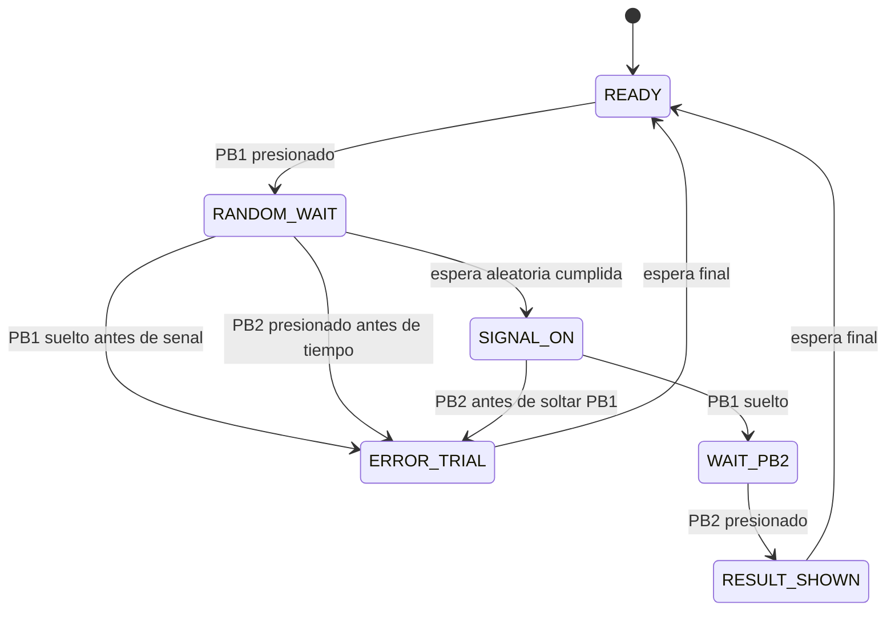

# Tarea 7 - Medidor de reaccion humana con ESP32, ESP-IDF, C y MQTT

## Objetivo

Construir un sistema de microcontroladores que mida el tiempo de reaccion humana ante una senal visual y sonora. El proyecto usa un ESP32 clasico ESP32-D0WD-V3 programado con ESP-IDF en lenguaje C, dos push buttons, un LED, un buzzer activo y MQTT para visualizar los datos en MQTTX.

La medicion principal es:

- Inicio del conteo: PB1 soltado.
- Fin del conteo: PB2 presionado.

El resultado se reporta en milisegundos. Internamente el firmware usa `esp_timer_get_time()` para tomar marcas de tiempo en microsegundos y luego convertir el resultado a milisegundos.

## Materiales

- ESP32 clasico ESP32-D0WD-V3 revision 3.
- 4 MB de flash.
- USB bridge Silicon Labs CP2102.
- 2 push buttons.
- 1 LED con resistencia limitadora.
- 1 buzzer activo.
- Computadora con MQTTX.
- Red WiFi con acceso a internet.

## Conexiones

| Elemento | GPIO ESP32 | Conexion | Nota |
|---|---:|---|---|
| PB1 | GPIO4 | Boton entre GPIO4 y GND | Pull-up interno, presionado = 0 |
| PB2 | GPIO5 | Boton entre GPIO5 y GND | Pull-up interno, presionado = 0 |
| LED | GPIO2 | GPIO2 -> resistencia -> LED -> GND | Activo en alto |
| Buzzer activo | GPIO18 | GPIO18 -> buzzer -> GND | Activo en alto |

Notas importantes:

- Los botones usan resistencias pull-up internas.
- Un boton presionado se lee como nivel bajo, es decir, `0` logico.
- El ESP32 clasico si tiene GPIO22, GPIO23 y GPIO25 validos, pero este proyecto no los necesita.
- No usar GPIO6 a GPIO11 porque estan conectados a la memoria flash interna de la placa.
- Evitar GPIO0, GPIO2, GPIO4, GPIO5, GPIO12 y GPIO15 para senales que puedan quedar forzadas durante el arranque. En este proyecto GPIO2 y GPIO4 se usan con cuidado: LED en GPIO2 y PB1 con pull-up interno en GPIO4.

## Funcionamiento

1. El sistema inicia en `READY` y publica `Listo: presiona y manten PB1`.
2. El usuario presiona y mantiene PB1.
3. El ESP32 detecta PB1 por interrupcion GPIO e inicia un ensayo.
4. El sistema espera un tiempo aleatorio entre 2000 ms y 6000 ms.
5. Si el usuario suelta PB1 antes de la senal, se publica error.
6. Si el usuario presiona PB2 antes de tiempo, tambien se publica error.
7. Al terminar la espera aleatoria, el LED se enciende y el buzzer se activa.
8. Esa senal indica que el usuario debe soltar PB1.
9. Al soltar PB1, el buzzer se apaga y empieza el conteo principal.
10. El usuario debe presionar PB2.
11. Al presionar PB2, termina el conteo.
12. El LED se apaga, el buzzer hace un beep corto y se publica el resultado.
13. Luego de unos segundos el sistema vuelve a `READY`.

## Maquina de estados

| Estado | Descripcion | Salida principal |
|---|---|---|
| `READY` | Espera que el usuario presione y mantenga PB1 | LED OFF, buzzer OFF |
| `RANDOM_WAIT` | Espera aleatoria de 2000 a 6000 ms | Vigila adelantamientos |
| `SIGNAL_ON` | Senal visual y sonora activa | LED ON, buzzer ON |
| `WAIT_PB2` | Cuenta desde PB1 suelto hasta PB2 presionado | LED ON, buzzer OFF |
| `RESULT_SHOWN` | Resultado publicado | LED OFF, beep corto |
| `ERROR_TRIAL` | Error por adelantamiento | LED OFF, buzzer OFF |



## Precision de medicion

Los botones se manejan con interrupciones GPIO en ambos flancos. En la interrupcion se toma la marca de tiempo usando `esp_timer_get_time()`, que entrega microsegundos. Luego el programa aplica antirrebote de aproximadamente 25 ms y procesa el evento en una cola FreeRTOS.

La medicion publicada es:

```c
tiempo_ms = (pb2_presionado_us - pb1_suelto_us) / 1000;
```

## Configuracion del proyecto

El proyecto esta configurado para:

- Target: `esp32`.
- Flash: 4 MB.
- PSRAM: deshabilitada/no requerida.
- Broker MQTT: `mqtt://broker.hivemq.com:1883`.
- Topico base: `Javier Pacheco/tarea8/reaccion`.
- WiFi configurable desde `idf.py menuconfig`.
- Usuario MQTT vacio por defecto.
- Contrasena MQTT vacia por defecto.

Opciones de `menuconfig`:

```text
Tarea 7 - Medidor de reaccion humana
  WiFi SSID
  WiFi password
  MQTT broker URI
  MQTT username
  MQTT password
  MQTT topic base
```

## MQTT

Topicos publicados:

| Topico | Contenido |
|---|---|
| `Javier Pacheco/tarea8/reaccion/estado` | Mensajes de estado en texto |
| `Javier Pacheco/tarea8/reaccion/evento` | Eventos del ensayo en JSON |
| `Javier Pacheco/tarea8/reaccion/resultado` | Resultado final en JSON |
| `Javier Pacheco/tarea8/reaccion/error` | Errores por adelantamiento en JSON |
| `Javier Pacheco/tarea8/reaccion/ip` | IP local del ESP32 en JSON |

Resultado ejemplo:

```json
{
  "ensayo": 1,
  "tiempo_pb1_suelto_a_pb2_ms": 410,
  "inicio_conteo": "pb1_suelto",
  "fin_conteo": "pb2_presionado",
  "espera_aleatoria_ms": 3580
}
```

Evento ejemplo:

```json
{
  "ensayo": 1,
  "evento": "senal_led_buzzer",
  "tiempo_ms": 12345
}
```

Error ejemplo:

```json
{
  "ensayo": 1,
  "error": "Error: soltaste PB1 antes de la senal",
  "tiempo_ms": 12345
}
```

## Configuracion en MQTTX

Crear una conexion nueva en MQTTX:

| Campo | Valor |
|---|---|
| Protocol | `mqtt://` |
| Host | `broker.hivemq.com` |
| Port | `1883` |
| Username | vacio |
| Password | vacio |
| SSL/TLS | desactivado |

Para ver todos los mensajes, suscribirse a:

```text
Javier Pacheco/tarea8/reaccion/#
```

## Comandos ESP-IDF

Configurar target:

```powershell
idf.py set-target esp32
```

Abrir configuracion:

```powershell
idf.py menuconfig
```

Compilar:

```powershell
idf.py build
```

Grabar en ESP32 por COM10:

```powershell
idf.py -p COM10 flash
```

Abrir monitor serie:

```powershell
idf.py -p COM10 monitor
```

Tambien se incluyen scripts PowerShell:

```powershell
.\scripts\build.ps1
.\scripts\flash_com10.ps1
.\scripts\monitor_com10.ps1
```

## Estructura de archivos

```text
Tarea 7/
  CMakeLists.txt
  sdkconfig.defaults
  main/
    CMakeLists.txt
    Kconfig.projbuild
    idf_component.yml
    main.c
  scripts/
    build.ps1
    flash_com10.ps1
    monitor_com10.ps1
    mqttx_subscribe.txt
```

## Notas para la practica

- Antes de compilar, entra a `idf.py menuconfig` y configura SSID y password WiFi.
- MQTTX solo visualiza los datos; no se necesita app movil.
- Si el usuario se adelanta, el ensayo se marca como error y no se publica resultado valido.
- El topico base solicitado usa `tarea8` aunque el proyecto se llama `Tarea 7`; se conserva exactamente como fue indicado.
