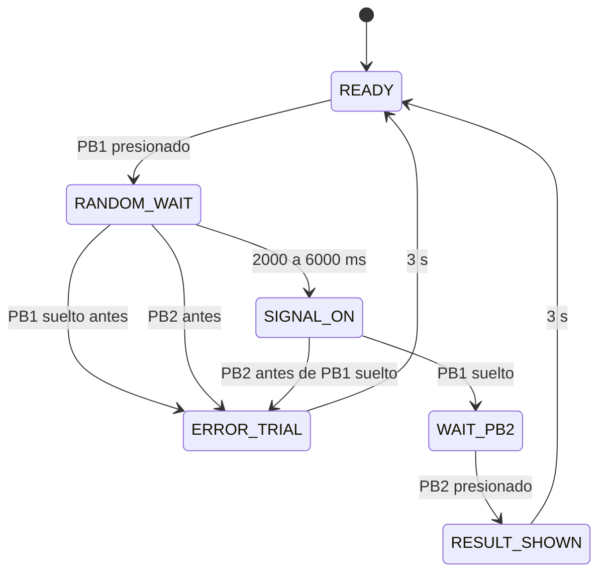

# Maquina de estados

La maquina de estados evita que el programa dependa de retardos bloqueantes largos. Cada estado tiene reglas claras de entrada, salida y error.

| Estado | Entrada principal | Evento esperado | Error posible |
|---|---|---|---|
| `READY` | Sistema listo | PB1 presionado | Ninguno |
| `RANDOM_WAIT` | PB1 ya esta presionado | Tiempo aleatorio cumplido | PB1 suelto o PB2 presionado antes de tiempo |
| `SIGNAL_ON` | LED y buzzer activos | PB1 suelto | PB2 presionado antes de soltar PB1 |
| `WAIT_PB2` | Conteo iniciado | PB2 presionado | Ninguno |
| `RESULT_SHOWN` | Resultado publicado | Espera de 3 s | Ninguno |
| `ERROR_TRIAL` | Error publicado | Espera de 3 s | Ninguno |

## Uso de interrupciones

PB1 y PB2 estan configurados con `GPIO_INTR_ANYEDGE`. Esto permite detectar:

- PB1 presionado.
- PB1 soltado.
- PB2 presionado.
- PB2 soltado.

Cada interrupcion genera un evento con:

- GPIO.
- Nivel leido.
- Marca de tiempo en microsegundos.

El antirrebote es de 25 ms. Si llega otro flanco antes de ese tiempo, se descarta.
